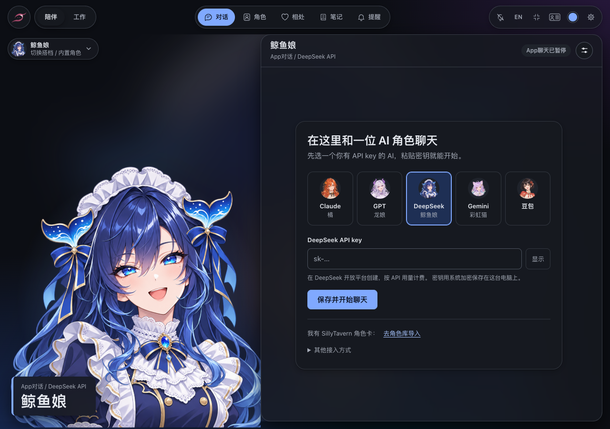
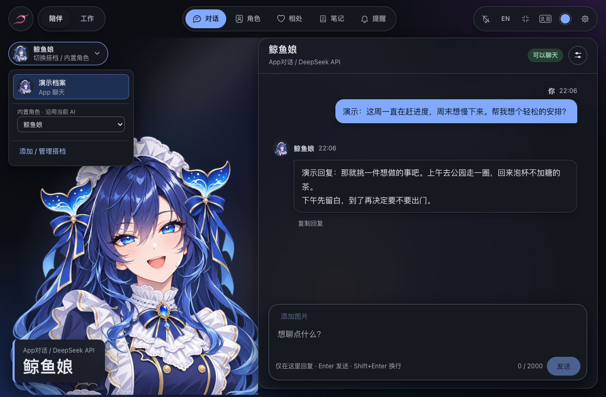

<p align="center"></p>

# Agent Arcade

**在桌面上和 AI 搭档聊天。** 自带一个 API key，选个角色，就能开始对话。聊天记录和每位搭档的记忆保存在自己的电脑上。Agent Arcade 以 AGPL-3.0 开源，模型调用费用由提供商另行收取。

[English](README.md) · [首次使用](docs/FIRST_RUN.md) · [验证记录](docs/VALIDATION.md)


*「陪伴 → 对话」的沉浸式布局。本文配图均使用 preview.8 界面和合成演示数据。[配图来源](docs/README_MEDIA.md)。*

## 开始聊天

1. 运行下文的[开发源码](#从源码运行)，打开 **陪伴 → 对话**。
2. 选择 Claude、GPT、DeepSeek、Gemini 或豆包，粘贴对应服务的 API key。
3. 点击 **保存并开始聊天**，发出第一条消息。



App 对话直接调用所选提供商。可以跳过社交账号、项目目录和本机 CLI 登录，陪伴对话也不会使用文件或终端工具。[提供商与渠道说明](docs/CHANNELS_AND_AI.md)。

## 切换搭档，查看和修改记忆

打开搭档切换器，可以换一位内置角色，沿用当前 AI 提供商和密钥。每位角色有自己的 App 对话与记忆，分别保存的搭档档案也会隔离凭据。已有 SillyTavern 角色卡时，可以在「角色」中导入 PNG 或 JSON，再选「用这个角色聊天」。[角色卡支持范围](docs/SILLYTAVERN_PARITY.md)。



进入 **相处 → 记得的事**，可查看、添加、修改或遗忘 App 记忆。若同时显示渠道来源，选择 **App 记忆** 查看当前搭档的本机事实。修改或遗忘也会清理该角色近期 App 对话和自由笔记，避免旧内容再次进入上下文；其他角色和 QQ 记录保留。[App 对话与记忆](docs/DESKTOP_CHAT.md)。


可以切换沉浸式、聊天应用式和极简工具式布局，选择日间、夜间或跟随系统，并让强调色跟随角色。[外观设置](docs/APPEARANCE.md)。

## 从源码运行

GitHub `main` 是 **0.4.0-preview.8 开发源码**。公开下载的是以前的 Windows [0.3.0-preview.2 预览版](https://github.com/Ray0766/agent-arcade/releases/tag/v0.3.0-preview.2)，使用[旧版微信派活与观察器流程](docs/releases/0.3.0-preview.2.md)。**目前没有公开可下载的 Mac 安装包。** [候选版状态](docs/CANDIDATE_STATUS.md) · [macOS 说明](docs/MACOS.md)。

安装 Git 和 [Node.js 24.18+（24.x）](https://nodejs.org/)，在新目录运行以下命令，即可使用和本文配图一致的源码检查点。

```sh
git clone --branch main --single-branch https://github.com/Ray0766/agent-arcade.git agent-arcade-companion
cd agent-arcade-companion
git checkout --detach e7b58508ffc79a108dc95f20685288ae3ca078d6
git rev-parse HEAD
npm ci
npm start
```

预期 HEAD 为 `e7b58508ffc79a108dc95f20685288ae3ca078d6`。若 Agent Arcade 已在运行，请先从应用菜单退出旧实例。[首次使用指南](docs/FIRST_RUN.md)。

## 本地数据与更新

数据默认保存在 `~/.agent-arcade/`，可用 `AGENT_ARCADE_HOME` 指定目录。未另设目录时，`npm start` 和 `npm run demo` 使用同一份数据。演示入口提供标了来源的「工作」观察器样例。API key 使用系统加密，聊天数据库可在本地读取。每次模型请求会把对话上下文发给你选择的提供商。[隐私与安全](SECURITY.md)。

切换版本前保留数据目录备份。Mac 凭据组件和首次系统授权属于配置它的那台 Mac。更新后若读不到以前的 key，可按文档恢复。[更新备份](docs/UPDATE_BACKUPS.md) · [凭据保留与恢复](docs/CREDENTIAL_RETENTION.md)。

## 可选功能

- **工作**可查看 Claude Code 会话事件、本地产物及 worktree 任务看板。任务交回后仍需验收。[任务看板](docs/TASK_BOARD.md)。
- **提醒**可按需启用日历、文件夹和订阅源。共享笔记与反思建议需主人批准。[陪伴功能](docs/COMPANION.md)。
- **渠道与语音**可单独设置。QQ 文档中的路线使用用户自备的桥接。[渠道与 AI](docs/CHANNELS_AND_AI.md) · [语音设置](docs/VOICE_LOCAL_SETUP.md)。

## 验证到哪一步

未发布的 Apple Silicon preview.8 已用真实 DeepSeek 做过有界检查，包括首条回复、切换搭档、退出重开后保留数据、手动记忆召回、搭档隔离和遗忘。另一台 Mac 首装、Intel、系统弹窗、中文输入法、休眠唤醒和外部用户试用仍待验收。[构建身份与验证范围](docs/REAL_MEMORY_FLOW_20261116.md) · [试用清单](docs/ADOPTION_TRIAL_KIT.md)。

## 参与开发

按锁文件安装依赖后，可运行 `npm test`、`npm run check`、`npm run check:first-run` 和 `npm run check:release`。[贡献指南](CONTRIBUTING.md) · [架构](docs/ARCHITECTURE.md) · [质量规范](docs/QUALITY_BRIEF.md)。

Agent Arcade 使用 [AGPL-3.0-only](LICENSE)，不设付费功能。已按 MIT 发布的旧版沿用[原许可证](LICENSE-MIT-HISTORICAL)。[第三方声明](THIRD_PARTY_NOTICES.md) · [SillyTavern 改编记录](src/vendor/sillytavern/README.md) · [配图与素材来源](docs/README_MEDIA.md)。
